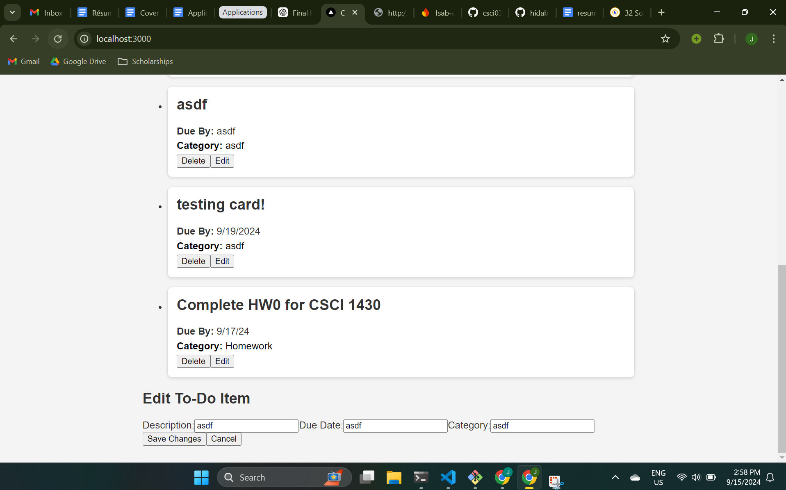

Hello FSAB! This is my application to join your club. My project is a simple to-do list. Some capabilities it has are adding new items, deleting items, and editing items. 

I basically just followed what I learned from the bootcamp -- creating a firebase database, setting up the back end with cors, dotenv, and express, setting up the frontend with React, and communicating between the two via API requests. Although the bootcamp taught me most of what I already needed to know, I researched how to implement PUT, DELETE, and POSTs as well as how to use status messages correctly.

Here are some screenshots:

